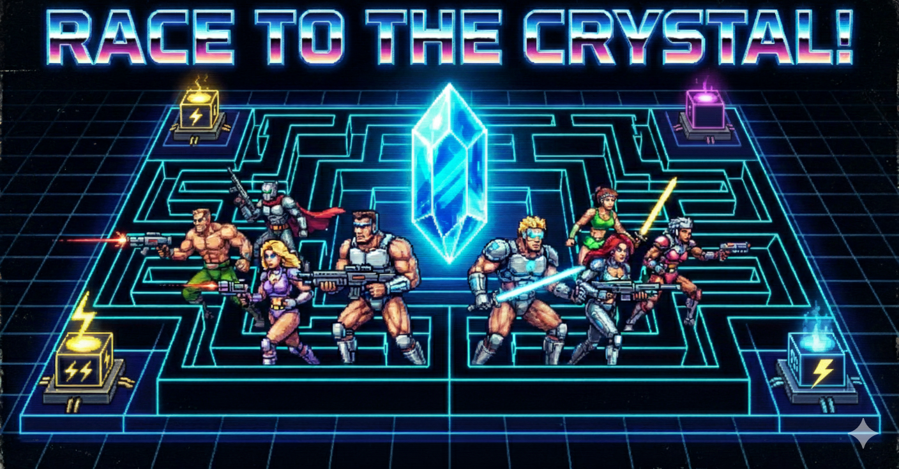

# Race to the Crystal

A networked multiplayer vector graphics game for 2-4 players with Tron/Battlezone-style visuals featuring both **2D top-down** and **3D first-person** views.

> **AI Disclosure**: This project was created with AI assistance for both code and assets.

## About

Race to the Crystal is a strategy game where players compete to capture a central crystal by deploying tokens across a 24x24 grid. The game features:

- **Dual rendering modes**: 2D top-down and 3D first-person views
- **Tron-style vector graphics** with glow effects and GPU acceleration
- **Strategic gameplay** with generators, mystery squares, and combat mechanics
- **Hot-seat multiplayer** for 2-4 players

## Tech Stack

- **Python** with **Arcade** for GPU-accelerated rendering
- **OpenGL** for 3D wireframe graphics and shaders
- **BFS pathfinding** for token movement
- **JSON serialization** for game state management
- **140+ unit tests** using pytest

## How to Play

### Installation & Running

```bash
# Install dependencies
uv sync

# Run the game
uv run race-to-the-crystal
```

### Controls

- **Mouse**: Click tokens to select, click cells to move, click enemies to attack
- **Space/Enter**: End turn
- **Escape**: Cancel selection
- **V**: Toggle between 2D and 3D views
- **TAB**: Switch between tokens (3D mode)
- **Q/E**: Rotate camera (3D mode)

### Game Rules

1. **Objective**: Capture the central crystal by holding it with 12 tokens for 3 turns
2. **Movement**: Each token can move 1-2 spaces per turn depending on its health
3. **Combat**: Attack adjacent enemies (damage = attacker health / 2)
4. **Generators**: Capture to reduce crystal requirement
5. **Mystery Squares**: Random events (heal or teleport)

See [GAME.md](GAME.md) for complete rules.

## Development

### Project Structure

```
race-to-the-crystal/
├── game/          # Core game logic
├── client/        # Rendering and UI
├── shared/        # Constants and enums
└── tests/         # Unit tests (140+ tests)
```

### Running Tests

```bash
# Run all tests
make test

# Run specific test
make test-specific FILE=tests/test_token.py

# See all test commands
make help
```

### Dependencies

```bash
# Install all dependencies
uv sync --group dev

# Install only production dependencies
uv sync
```

## License

This project is licensed under the **MIT License**. See the [LICENSE](LICENSE.md) file for details.
