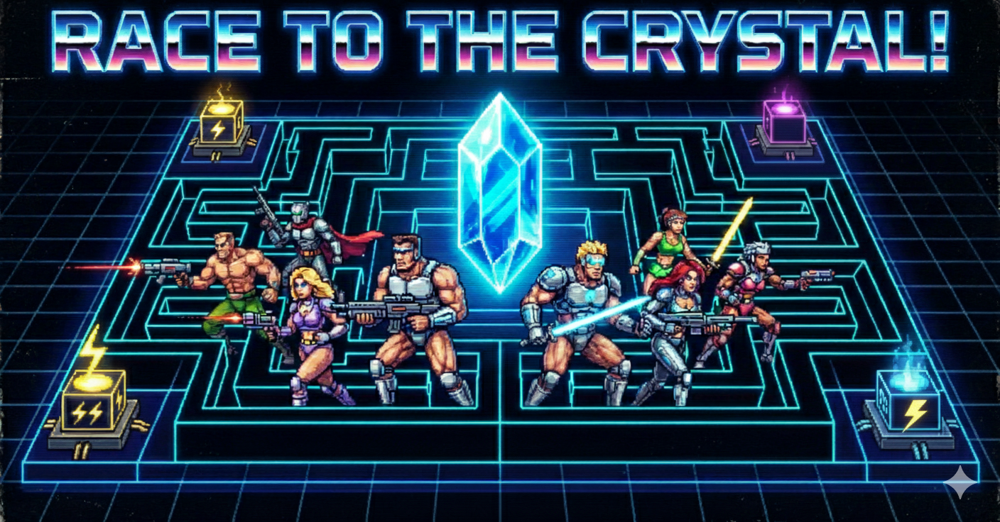

# Race to the Crystal

A networked multiplayer strategy game for 2-4 players with Tron/Battlezone-style vector graphics. Play on desktop (2D/3D) or in your browser (3D web client).

> **AI Disclosure**: This project was created with AI assistance for both code and assets.

## About

Race to the Crystal is a turn-based strategy game where players compete to capture a central crystal by deploying tokens across a 24x24 grid. Features:

- **Desktop Client**: 2D top-down and 3D first-person modes (Python + Arcade + OpenGL)
- **Web Client**: Browser-based 3D view (JavaScript + Babylon.js)
- **Network Multiplayer**: Desktop and web clients play together on the same server
- **AI Players**: Multiple strategy modes (random, aggressive, defensive)
- **Strategic Gameplay**: Generators, mystery squares, combat, and token deployment
- **GPU-Accelerated Graphics**: Tron-style wireframes with glow effects

## Tech Stack

- **Backend**: Python with asyncio, TCP/WebSocket, and HTTP REST (JWT Authentication) servers
- **Desktop Client**: Arcade with OpenGL shaders
- **Web Client**: Babylon.js 8 with Mercure (SSE) state synchronization
- **Testing**: 276 unit tests with pytest

## Quick Start

```bash
# Install dependencies
uv sync

# Play local single-player (desktop)
uv run race-to-the-crystal

# Play multiplayer (desktop + web clients)
uv run race-unified-server
# Then open http://localhost:8080 in your browser
# Or connect desktop clients via the game menu
```

## Game Modes

### 1. Local Single-Player (Desktop)
```bash
uv run race-to-the-crystal
# Toggle between 2D/3D views with 'V' key
```

### 2. Network Multiplayer (Desktop + Web)

**Start the unified server:**
```bash
uv run race-unified-server
# Runs on ports 8888 (TCP) and 8080 (HTTP/WebSocket)
```

**Option A: Desktop Client**
```bash
uv run race-to-the-crystal
# Click "Host Network Game" or "Join Network Game"
```

**Option B: Web Browser**
- Open http://localhost:8080 in your browser
- Play with 3D Babylon.js renderer

**Option C: AI Players**
```bash
# TCP AI Client (Creates/Joins via socket)
uv run race-ai-client --create "My Game" --name "Bot"
uv run race-ai-client --join <game-id> --strategy aggressive

# HTTP AI Client (Joins via REST/SSE)
uv run race-http-ai-client --join <game-id> --strategy defensive
```

All client types (desktop, web, AI) can play together in the same game!

**See [docs/NETWORK.md](docs/NETWORK.md) for detailed multiplayer setup.**

## Controls

**Desktop Client:**
- **Mouse Click**: Select tokens, move, attack, deploy
- **Arrow Keys/WASD**: Pan camera
- **V**: Toggle 2D/3D view
- **TAB**: Cycle through tokens (3D first-person mode)
- **Space/Enter**: End turn
- **M**: Toggle music

**Web Client:**
- **Mouse**: Click to interact, drag to rotate camera, scroll to zoom
- **Space**: End turn

**See [docs/3D.md](docs/3D.md) for complete desktop 3D controls.**

## Game Rules

1. **Win Condition**: Hold the crystal with 12 tokens for 3 consecutive turns
2. **Movement**: Tokens move 1-2 spaces based on current health
3. **Combat**: Attack adjacent enemies (damage = attacker HP ÷ 2)
4. **Generators**: Capture with 2 tokens for 2 turns to reduce crystal requirement
5. **Mystery Squares**: Random heal or teleport events

**See [docs/GAME.md](docs/GAME.md) for complete rules and mechanics.**

## Development

### Project Structure

```
race-to-the-crystal/
├── game/          # Core game logic (no rendering dependencies)
├── client/        # Desktop client (Arcade + OpenGL)
├── server/        # Unified server (TCP + HTTP/WebSocket)
├── web_server/    # Web client (Babylon.js frontend)
├── network/       # Protocol and connection handling
├── shared/        # Constants and enums
├── deployment/    # Container deployment configs
│   ├── docs/      # Deployment guides
│   ├── dockerfiles/ # Container images
│   ├── development/ # Dev quadlets
│   └── production/  # Production quadlets
├── tests/         # 276 unit tests
└── docs/          # Detailed documentation
```

### Testing

```bash
make test              # Run all tests
make test-coverage     # Run with coverage report
make lint              # Check code quality
```

### Deployment

Deploy to production using containerized deployment:

```bash
# See complete deployment guide
cat deployment/docs/DEPLOYMENT.md

# Quick: Development deployment (localhost)
cd deployment/dockerfiles
podman build -f Dockerfile -t localhost/race-to-the-crystal:latest ../..
podman build -f Dockerfile.caddy -t localhost/race-caddy:latest ../..
# Deploy quadlets from deployment/development/
```

**[deployment/docs/DEPLOYMENT.md](deployment/docs/DEPLOYMENT.md)** - Complete deployment guide

### Documentation

**Game & Development:**
- **[docs/GAME.md](docs/GAME.md)** - Complete game rules and mechanics
- **[docs/NETWORK.md](docs/NETWORK.md)** - Network multiplayer setup and protocol
- **[docs/3D.md](docs/3D.md)** - Desktop 3D mode camera system and controls
- **[docs/WEB.md](docs/WEB.md)** - Web client architecture and API
- **[CLAUDE.md](CLAUDE.md)** - Development guide for contributors

**Deployment:**
- **[deployment/docs/DEPLOYMENT.md](deployment/docs/DEPLOYMENT.md)** - Container deployment guide
- **[deployment/docs/MERCURE.md](deployment/docs/MERCURE.md)** - Mercure SSE configuration

## License

This project is licensed under the **MIT License**. See the [LICENSE](LICENSE.md) file for details.
